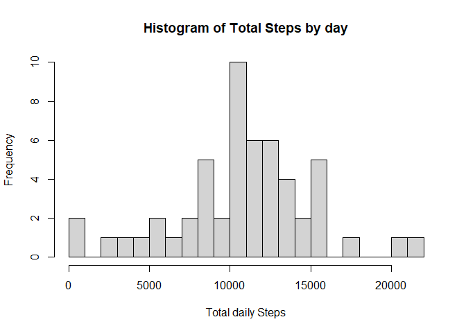

## Loading and preprocessing the data


```r
unzip("activity.zip")
stepdata <- read.csv("activity.csv", header = TRUE)
data <- read.csv("activity.csv", header = TRUE)
head(stepdata)
```

```
##   steps       date interval
## 1    NA 2012-10-01        0
## 2    NA 2012-10-01        5
## 3    NA 2012-10-01       10
## 4    NA 2012-10-01       15
## 5    NA 2012-10-01       20
## 6    NA 2012-10-01       25
```

## What is mean total number of steps taken per day?


```r
library(dplyr)
```

```
## Warning: package 'dplyr' was built under R version 4.0.2
```

```
## 
## Attaching package: 'dplyr'
```

```
## The following objects are masked from 'package:stats':
## 
##     filter, lag
```

```
## The following objects are masked from 'package:base':
## 
##     intersect, setdiff, setequal, union
```

```r
library(magrittr)
databydate <- stepdata %>% select(date, steps) %>% group_by(date) %>% summarize(tsteps= sum(steps)) %>%na.omit()
```

```
## `summarise()` ungrouping output (override with `.groups` argument)
```

```r
hist(databydate$tsteps, xlab = "Total daily Steps",main="Histogram of Total Steps by day", breaks = 20)
```

<!-- -->

### Mean of the total number of the steps taken per day

```r
mean(databydate$tsteps)
```

```
## [1] 10766.19
```
### Median of the total number of the steps taken per day

```r
median(databydate$tsteps)
```

```
## [1] 10765
```

## What is the average daily activity pattern?

```r
library(ggplot2)
```

```
## Warning: package 'ggplot2' was built under R version 4.0.2
```

```r
averages <- aggregate(x=list(steps=stepdata$steps), by=list(interval=stepdata$interval),
                      FUN=mean, na.rm=TRUE)
ggplot(data=averages, aes(x=interval, y=steps)) +
    geom_line() +
    xlab("5-minute interval") +
    ylab("average number of steps taken")
```

<!-- -->

On average across all the days in the dataset, the 5-minute interval contains
the maximum number of steps?

```r
averages[which.max(averages$steps),]
```

```
##     interval    steps
## 104      835 206.1698
```


## Imputing missing values

```r
missing <- is.na(data$steps)
# How many missing
table(missing)
```

```
## missing
## FALSE  TRUE 
## 15264  2304
```

```r
library(magrittr)
library(dplyr)

replacewithmean <- function(x) replace(x, is.na(x), mean(x, na.rm = TRUE))
meandata <- stepdata%>% group_by(interval) %>% mutate(steps= replacewithmean(steps))
head(meandata)
```

```
## # A tibble: 6 x 3
## # Groups:   interval [6]
##    steps date       interval
##    <dbl> <chr>         <int>
## 1 1.72   2012-10-01        0
## 2 0.340  2012-10-01        5
## 3 0.132  2012-10-01       10
## 4 0.151  2012-10-01       15
## 5 0.0755 2012-10-01       20
## 6 2.09   2012-10-01       25
```

Make a histogram of the total number of steps taken each day and Calculate and report the mean and median total number of steps taken per day.

```r
FullSummedDataByDay <- aggregate(meandata$steps, by=list(meandata$date), sum)

names(FullSummedDataByDay)[1] ="date"
names(FullSummedDataByDay)[2] ="totalsteps"
head(FullSummedDataByDay,15)
```

```
##          date totalsteps
## 1  2012-10-01   10766.19
## 2  2012-10-02     126.00
## 3  2012-10-03   11352.00
## 4  2012-10-04   12116.00
## 5  2012-10-05   13294.00
## 6  2012-10-06   15420.00
## 7  2012-10-07   11015.00
## 8  2012-10-08   10766.19
## 9  2012-10-09   12811.00
## 10 2012-10-10    9900.00
## 11 2012-10-11   10304.00
## 12 2012-10-12   17382.00
## 13 2012-10-13   12426.00
## 14 2012-10-14   15098.00
## 15 2012-10-15   10139.00
```
Summary of data

```r
summary(FullSummedDataByDay)
```

```
##      date             totalsteps   
##  Length:61          Min.   :   41  
##  Class :character   1st Qu.: 9819  
##  Mode  :character   Median :10766  
##                     Mean   :10766  
##                     3rd Qu.:12811  
##                     Max.   :21194
```
Histogram

```r
hist(FullSummedDataByDay$totalsteps, xlab = "Steps", ylab = "Frequency", main = "Total Daily Steps", breaks = 20)
```

<!-- -->
Mean

```r
oldmean <- mean(databydate$tsteps, na.rm = TRUE)
newmean <- mean(FullSummedDataByDay$totalsteps)
# Old mean and New mean
oldmean
```

```
## [1] 10766.19
```

```r
newmean
```

```
## [1] 10766.19
```
Median

```r
oldmedian <- median(databydate$tsteps, na.rm = TRUE)
newmedian <- median(FullSummedDataByDay$totalsteps)
# Old median and New median
oldmedian
```

```
## [1] 10765
```

```r
newmedian
```

```
## [1] 10766.19
```

Mean and median values are higher after imputing missing data.

## Are there differences in activity patterns between weekdays and weekends?

```r
meandata$date <- as.Date(meandata$date)
meandata$weekday <- weekdays(meandata$date)
meandata$weekend <- ifelse(meandata$weekday=="Saturday" | meandata$weekday=="Sunday", "Weekend", "Weekday" )
library(ggplot2)
meandataweekendweekday <- aggregate(meandata$steps , by= list(meandata$weekend, meandata$interval), na.omit(mean))
names(meandataweekendweekday) <- c("weekend", "interval", "steps")

ggplot(meandataweekendweekday, aes(x=interval, y=steps, color=weekend)) + geom_line()+
facet_grid(weekend ~.) + xlab("Interval") + ylab("Mean of Steps") +
    ggtitle("Comparison of Average Number of Steps in Each Interval")
```

<!-- -->
